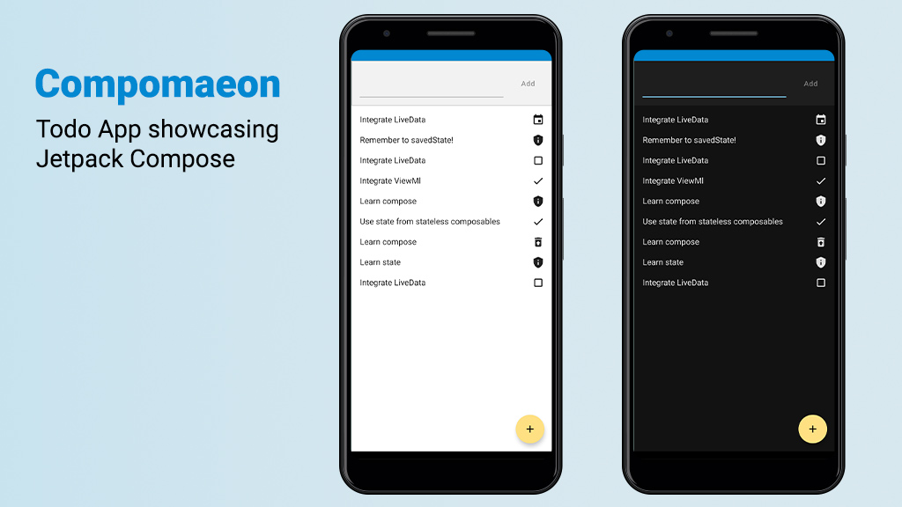

# Compomaeon

Little Todo Android App showcasing [Jetpack Compose][1].



Inspired by [Using State in Jetpack Compose Codelab][2] enhanced with [Dagger Hilt][3] for
Dependency Injection and Android Room to store the todo's.

```text
Copyright (c) 2021. Christian Grach <christian.grach@cmgapps.com>

Licensed under the Apache License, Version 2.0 (the "License");
you may not use this file except in compliance with the License.
You may obtain a copy of the License at

     http://www.apache.org/licenses/LICENSE-2.0

Unless required by applicable law or agreed to in writing, software
distributed under the License is distributed on an "AS IS" BASIS,
WITHOUT WARRANTIES OR CONDITIONS OF ANY KIND, either express or implied.
See the License for the specific language governing permissions and
limitations under the License.
```

[1]: https://developer.android.com/jetpack/compose

[2]: https://developer.android.com/codelabs/jetpack-compose-state

[3]: https://dagger.dev/hilt/
